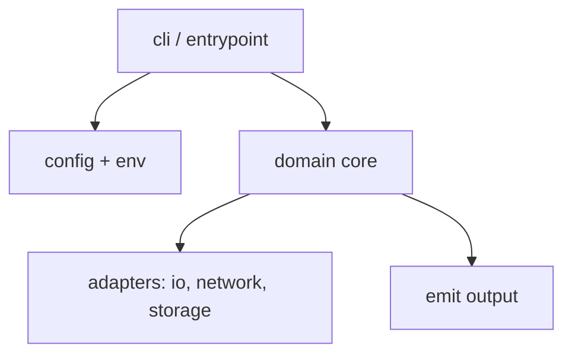

# Implementation plan

**Contract:** **`PLANNED_INTERFACE.md`**. This file maps it to modules and delivery phases. **v1 checklist:** **[`TODO.md`](TODO.md)**. **v1 `D-…`:** **[`DECISIONS.md`](DECISIONS.md)**. **Backlog:** **[`BACKLOG.md`](BACKLOG.md)**.

---

## 0. `.cursorrules` and project conventions

**Repo rules file:** [`.cursor/rules/.cursorrules`](.cursor/rules/.cursorrules)

### From `.cursorrules` (workflow and code quality)

- **Complex work:** Short plan first, then approval before large or multi-file changes.
- **Simple work:** Implement directly; think step-by-step about correctness.
- **Structure:** Split functions that grow too long.
- **Debugging:** Prefer logging/tracing (e.g. behind **`--verbose`**, **stderr**) before speculative fixes.

### Project-specific conventions (edit for your repo)

- **Scope:** Implement only what the task describes; avoid unrelated refactors.
- **Public contract:** Anything documented in **`PLANNED_INTERFACE.md`** changes only with intent and doc updates.
- **Secrets:** Never log credentials; document env names in **`--help`** / README only.
- **Failures:** Prefer structured partial success if that matches the contract.

---

## 1. Goals and non-goals

### Goals

- *(Bullet list aligned with **`PLANNED_INTERFACE.md`**.)*

### Non-goals (initially)

- *(Explicit exclusions to prevent scope creep.)*

---

## 2. Stack

Lock language, packaging, and key libraries here and in **`PLANNED_INTERFACE.md`** / **`DECISIONS.md`** as **`D-…`** rows where helpful. A tabular summary can live in **§5** below.

---

## 3. Architecture (modules)

Think in layers so boundaries stay clear.



**Suggested package layout** (`api_spend`):

```text
src/api_spend/
  __init__.py
  cli/
  models/
  config.py
  ...
```

---

## 4. Phased delivery

Work in **vertical slices** where each phase leaves something runnable. Per **§0**, treat each phase (or risky slice) as a checkpoint to **outline next steps** before large implementation.

| Phase | Focus | Exit criterion |
|-------|--------|----------------|
| **1** | Core models + fixtures match contract | Unit tests round-trip fixtures |
| **2** | CLI/API skeleton, no external side effects | Help and stub paths work |
| **3** | Config + validation command | Invalid config fails with structured errors |
| **4** | Primary operation (read-only inputs) | End-to-end against fixtures |
| **5** | Integrations (network, DB, …) | Mocked tests; optional opt-in live tests |
| **6** | Hardening: CI, schema export, docs | Matches **`PLANNED_INTERFACE.md`** and **`TODO.md`** |

Add, split, or reorder phases for your project.

---

## 5. Stack and locked contract (reference)

Single place for **tooling** and **behaviors** that are also locked in **`PLANNED_INTERFACE.md`** or **`DECISIONS.md`**.

| Topic | Decision |
|--------|-----------|
| Language / packaging | *(e.g. Python 3.12+ + `pyproject.toml`)* |
| CLI / API framework | *(e.g. Typer, FastAPI, …)* |
| Config format | *(e.g. YAML, TOML)* |
| Testing | *(e.g. pytest + optional jsonschema)* |

---

## 6. Testing strategy

- **Unit:** pure logic, parsers, merge rules.
- **Integration:** subprocess or HTTP client against local instance; assert exit codes / status codes and payload shape.
- **Contract:** optional JSON Schema check in CI so refactors cannot drift silently.

---

## 7. Risks and mitigations

| Risk | Mitigation |
|------|------------|
| *(add rows)* | |

---

## 8. Relation to other docs

- **`PLANNED_INTERFACE.md`:** Update first when the contract changes.
- **`DECISIONS.md`:** **`D-…`** register for v1; **`TODO.md`** **`Refs:`** point at rows.
- **`BACKLOG.md`:** **`Vx-…`** and open ideas for later majors.
