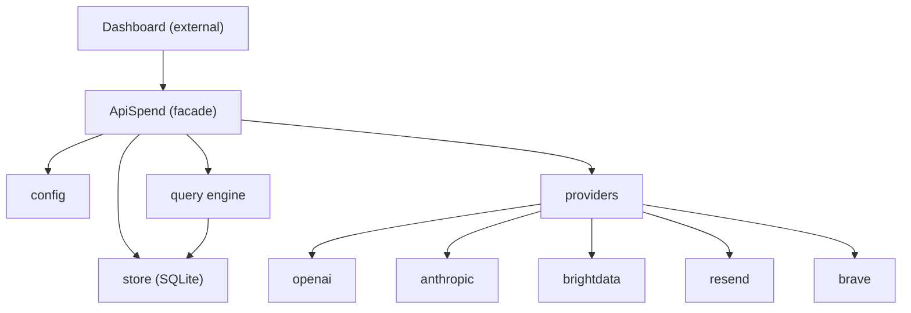

# Implementation plan

**Contract:** [`PLANNED_INTERFACE.md`](PLANNED_INTERFACE.md) §0 · **Checklist:** [`TODO.md`](TODO.md) · **`D-…`:** [`DECISIONS.md`](DECISIONS.md) §2–§3 · [`BACKLOG.md`](BACKLOG.md) · Retros: [`implementation-notes.md`](implementation-notes.md).

**vs `TODO.md`:** This file = stack, module boundaries, phase **map**. [`TODO.md`](TODO.md) = `[x]` / `[ ]` only. Norms → link `PLANNED_INTERFACE.md` § anchors; do not duplicate.

**Agents:** [`README.md`](README.md) (cwd + tests). Facade `src/api_spend/client.py` (`ApiSpend`). Sync window `D-BILLING-SYNC-WINDOW-V1` / §5.1. Graph §3.

---

## 0. `.cursorrules` and project conventions

**Repo rules file:** [`.cursor/rules/.cursorrules`](.cursor/rules/.cursorrules)

### From `.cursorrules` (workflow and code quality)

- **Complex work:** Short plan first; get alignment before large multi-file changes.
- **Simple work:** Implement directly; prioritize correctness.
- **Structure / debugging:** Keep functions focused; prefer evidence (logs/traces) before guessing fixes.

### Project-specific conventions

- **Scope:** Implement only what the task describes; avoid unrelated refactors.
- **Public contract:** Anything documented in **`PLANNED_INTERFACE.md`** changes only with intent and doc updates.
- **Secrets:** Never log credentials; document env names only.
- **Failures:** Prefer in-band detail (`SyncResult.providers[].error`, `QueryResult.gaps`); reserve exceptions for config/store failures and invalid inputs.

---

## 1. Goals and non-goals

### Goals

- Installable Python package (`api-spend`) that the dashboard project imports directly.
- Six operations matching the contract: `sync`, `query`, `providers`, `status`, `validate`, `reset`.
- Five provider adapters: OpenAI, Anthropic, Bright Data (billing-API); Resend, Brave Search (snapshot-based).
- Local SQLite store owned by the package; dashboard never touches it directly.
- Honest coverage and gap reporting so the dashboard can render charts without guessing.

### Non-goals (initially)

- HTTP server mode (backlog).
- Google Cloud / BigQuery adapter (backlog).
- Multi-currency conversion (v1 assumes USD).
- Budget/threshold alerts (backlog).
- Tag/label dimensions beyond provider + service (backlog).
- CLI for operators (could be added later with Typer; v1 surface is the Python API).

---

## 2. Stack

| Topic | Decision | Source |
|-------|----------|--------|
| Language | Python 3.11+ | Broad compatibility while supporting modern type syntax |
| Packaging | `pyproject.toml`; install with `pip` (dev: optional `uv`) | `pyproject.toml` |
| Config format | YAML | `D-CONFIG-FORMAT` |
| Config parsing | PyYAML + Pydantic for validation | `.cursorrules` defaults |
| HTTP client | httpx | `.cursorrules` defaults |
| Data validation + public models | Pydantic v2 `BaseModel` for config **and** all public return types (`SpendBucket`, `QueryResult`, etc.) — gives dashboard `.model_dump()` / `.model_dump_json()` for free | `.cursorrules` defaults |
| Local store | SQLite (stdlib `sqlite3`) | No extra dependency; single-user local use case |
| Testing | pytest | `.cursorrules` defaults |
| Logging | stdlib `logging` under `api_spend.*` | Caller configures handlers and levels; see **`PLANNED_INTERFACE.md` §4.4** (no log-level env var in **§8** for v1) |

---

## 3. Architecture (modules)



### Package layout

```text
pyproject.toml
src/api_spend/
  __init__.py              # Public exports per api_spend.__all__ (incl. ApiSpend, models, helpers)
  client.py                # ApiSpend facade
  config.py                # Pydantic config model, YAML loader, env resolution
  models.py                # Public Pydantic BaseModels: SpendRecord, SpendBucket, QueryResult, etc.
  exceptions.py            # ApiSpendError, ConfigError, CredentialError, StoreError
  store.py                 # SQLite: schema, CRUD, sync metadata, snapshots
  query.py                 # Bucketing, grouping, gap detection, coverage
  http_raw_dump.py         # optional API_SPEND_*_RAW_RESPONSE_PATH capture (billing adapters)
  providers/
    __init__.py             # provider registry (name → class)
    base.py                 # BillingApiProvider, SnapshotProvider (abstract)
    openai.py
    anthropic.py
    brightdata.py
    resend.py
    brave.py
tests/
  test_*.py                 # unit + integration (store, query, adapters, snapshot_sync, client, …)
  test_phase9_contract.py   # models, §8 env wiring, exceptions, empty-store behavior
  test_doc_drift.py         # README / plan stale wording
  test_public_schema_snapshot.py  # vs schemas/public_pydantic_schemas.json
  test_*_live.py            # opt-in HTTP (API_SPEND_LIVE_TESTS=1); full stack: test_api_spend_live.py
  test_live_cost_dump_fixtures.py  # sanitized live-dump JSON (SpendRecord)
  fixtures/
    *_live_costs_sanitized.json   # OpenAI, Anthropic, Bright Data
```

### Key design decisions

**Facade pattern:** `ApiSpend` in `client.py` is the single public entry point. It holds references to config, store, and a provider registry. Each public method (`sync`, `query`, etc.) delegates to the appropriate internal module. This keeps the interface contract in one place and the internals free to change.

**Config + credentials:** `ApiSpend.__init__` uses `load_config` with optional **`require_credentials`** (default **`True`**) and optional injected **`SpendStore`** — **`D-FACADE-INIT-V1`**, **`PLANNED_INTERFACE.md`** section 4.3. Integration tests: prefer dummy env vars + **`httpx.MockTransport`**; use **`require_credentials=False`** or injected store when needed.

**Provider abstraction:** `providers/base.py` defines **`FetchCostsResult`**, **`BillingApiProvider`**, and **`SnapshotProvider`**. **`client.sync`** branches: billing → **`fetch_costs(start, end)`** with UTC windows per **`D-BILLING-SYNC-WINDOW-V1`** / **`PLANNED_INTERFACE.md`** section 5.1; snapshot → **`run_snapshot_sync`** (fixed **`service`** labels per **`D-PROVIDER-CAPS-V1`**).

**SQLite store:** Open the database under **`resolve_store_path()`** from `config.py` (directory only; pick a single filename, e.g. `spend.sqlite`, inside it). Three tables handle the full data lifecycle:

```sql
CREATE TABLE spend_records (
    provider    TEXT    NOT NULL,
    service     TEXT    NOT NULL,
    date        TEXT    NOT NULL,  -- ISO 8601 date
    amount      TEXT    NOT NULL,  -- Decimal as string for precision
    currency    TEXT    NOT NULL,
    UNIQUE(provider, service, date)
);

CREATE TABLE sync_metadata (
    provider      TEXT    PRIMARY KEY,
    last_synced   TEXT    NOT NULL,  -- ISO 8601 datetime UTC
    latest_date   TEXT               -- most recent date covered
);

CREATE TABLE snapshots (
    provider       TEXT    NOT NULL,
    recorded_at    TEXT    NOT NULL,  -- ISO 8601 datetime UTC
    counter_value  INTEGER NOT NULL,
    quota_period   TEXT,               -- e.g. YYYY-MM (monthly quota) or YYYY-MM-DD (daily quota)
    UNIQUE(provider, recorded_at)
);
```

`amount` is stored as TEXT and parsed to `Decimal` on read to avoid floating-point drift. Deduplication uses `INSERT OR REPLACE` on the unique constraint for spend_records.

**Query engine:** `query.py` reads raw spend_records from the store, then:

1. Generates contiguous bucket boundaries for the requested `[start, end)` range and granularity (**`day`** = calendar days; **`week`** = ISO Monday–aligned segments with a possibly short first segment from `start`; **`month`** = calendar months clipped to the range — see **`D-QUERY-BUCKETS-V1`**).
2. Groups records into buckets, applying the `group_by` keys.
3. Fills missing buckets with zero-amount entries.
4. Computes `coverage` per bucket by checking whether all configured providers have data covering the full bucket.
5. Builds `GapInfo` entries for any provider × date-range holes.

---

## 4. Phased delivery

Work in **vertical slices** where each phase leaves something runnable and testable. Per section 0, treat each phase as a checkpoint.

| Phase | Focus | Exit criterion |
|-------|-------|----------------|
| **1** | Project scaffold, models, exceptions | `pip install -e .` succeeds; models importable; unit tests pass |
| **2** | Config loading + validation | Config loads from YAML, validates with Pydantic, resolves env vars; invalid config raises `ConfigError`; tests pass |
| **3** | SQLite store | Insert, query, delete spend records; sync metadata CRUD; snapshot CRUD; `reset` clears data; tests pass against in-memory SQLite |
| **4** | Query engine | Bucketing, grouping, gap detection, coverage; tests pass against fixture data in store |
| **5** | Provider framework + OpenAI adapter | `FetchCostsResult`, registry, OpenAI costs adapter; unit tests with mocked HTTP; tests pass |
| **6** | Remaining billing-API adapters | Anthropic + Bright Data adapters; mocked tests pass |
| **7** | Snapshot-based adapters | Resend + Brave adapters; snapshot delta logic; mocked tests pass |
| **8** | Facade wiring + integration tests | `ApiSpend` wires all operations per **`D-FACADE-INIT-V1`** / §4.3; **`sync`** per **`D-BILLING-SYNC-WINDOW-V1`** / §5.1; end-to-end tests with **`httpx` mocks** + optional **`test_api_spend_live.py`** (README) |
| **9** | Hardening | Logging, edge cases (empty store, no providers, partial failures), README / contract upkeep, doc drift + public schema CI, contract alignment checks |

---

## 5. Stack and locked contract (reference)

Single place for **tooling** and **behaviors** locked in [`PLANNED_INTERFACE.md`](PLANNED_INTERFACE.md) or [`DECISIONS.md`](DECISIONS.md).

| Topic | Decision | Ref |
|-------|----------|-----|
| Package name | `api-spend`, import as `api_spend` | `D-RELEASE-NAME` |
| v1 providers | OpenAI, Anthropic, Bright Data (billing-API); Resend, Brave Search (snapshot) | `D-V1-PROVIDERS` |
| Config format | YAML | `D-CONFIG-FORMAT` |
| Currency | USD only, no conversion | `D-CURRENCY-V1` |
| Query week/month buckets | ISO Monday–aligned weeks (short first segment from `start`); calendar months clipped to range | `D-QUERY-BUCKETS-V1` |
| Billing fetch errors | `BillingApiProvider.fetch_costs` → `FetchCostsResult(records, error)`; no raise for provider HTTP errors | `D-BILLING-FETCH-V1` |
| First-sync lookback | 60 days default, configurable | `D-LOOKBACK` |
| Billing sync windows + metadata + `records_added` | UTC **`[start, end)`**; metadata only on success; row counts per §5.1 | `D-BILLING-SYNC-WINDOW-V1` |
| `ApiSpend` init | Optional `store=`, `require_credentials=` | `D-FACADE-INIT-V1` |
| Static provider capabilities | Per §5.3; snapshot services `emails` / `requests` | `D-PROVIDER-CAPS-V1` |
| Config path | `~/.config/api-spend/config.yaml` (override: `API_SPEND_CONFIG` or constructor path) | `PLANNED_INTERFACE.md` §4.2 |
| Store path | `~/.local/share/api-spend/` | `PLANNED_INTERFACE.md` §8 |

---

## 6. Testing strategy

- **Unit (phases 1–6):** Models, config, store, query, OpenAI + Anthropic + Bright Data adapters — no live network by default. SQLite `:memory:`; HTTP via **`httpx.MockTransport`** for adapters.
- **Provider mocks (phase 7):** Same pattern for snapshot adapters; assert normalized **`SpendRecord`** output.
- **Integration (phase 8):** Full `ApiSpend` lifecycle: configure → validate → sync → query → reset. **Mocked HTTP** (`httpx.MockTransport` or injected clients), temp or `:memory:` **store**, dummy credentials as needed. Assert partial sync failure, **`validate(check_connectivity=False)`** vs **`True`**, contract shapes (buckets, gaps, coverage).
- **Optional live tests:** `API_SPEND_LIVE_TESTS=1` + keys — see [README](README.md). Per-provider: `tests/test_openai_live.py`, `test_anthropic_live.py`, `test_brightdata_live.py`, `test_resend_live.py`, `test_brave_live.py`. Full stack: `tests/test_api_spend_live.py` (`ApiSpend` + `API_SPEND_CONFIG`). Optional: `API_SPEND_LIVE_DUMP_PATH`, `API_SPEND_*_RAW_RESPONSE_PATH` (`http_raw_dump.py`). Not CI by default.

---

## 7. Risks and mitigations

| Risk | Mitigation |
|------|------------|
| Provider API changes or undocumented quirks | Pin to known API versions where possible; adapter tests against canned responses catch regressions; live tests validate periodically |
| Anthropic requires admin API key (`sk-ant-admin…`) | Document prominently in config and error messages; `validate` checks key format before making calls |
| Brave Search: probe is a real search request; rate-limit headers may be comma-separated | Cheapest `web/search` call; **$5 / 1,000** in contract; parse limits per **`PLANNED_INTERFACE.md`** section 3.2 |
| SQLite concurrent access | Single-user local use case; document that concurrent writes from multiple processes are not supported; WAL mode for reader/writer overlap |
| Decimal precision in SQLite | Store as TEXT, parse to `Decimal` on read; never use REAL/FLOAT for amounts |
| Snapshot-based providers: missed syncs lose granularity | Document in interface (already done); delta assigned to a single record spanning the gap; `coverage: "estimated"` is honest |

---

## 8. Relation to other docs

- **`PLANNED_INTERFACE.md`:** Update first when the contract changes. Implementation must match the normative sections (roughly §3–§8, including §6).
- **`DECISIONS.md`:** `D-…` register for v1; `TODO.md` `Refs:` point at rows.
- **`BACKLOG.md`:** `Vx-…` and open ideas for later (HTTP server, Google Cloud, budgets, tags, advanced store, usage metrics, forecasting, etc.).
- **`implementation-notes.md`:** informal phase retrospectives; not contract.
